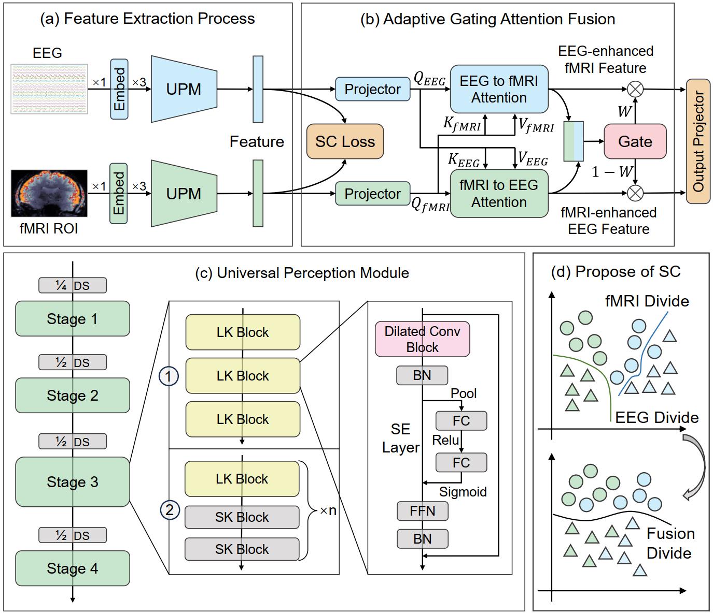

# Exploring Cognitive Workload Recognition Using CogRepLKNet with EEG-fMRI

This paper investigates the potential of re-parameterizable Large-Kernel (LK) Dilated Convolutional Neural Networks (CNNs) for decoding, fusion, and recognition of multimodal cognitive workload data from EEG and fMRI. Based on this, we propose a universal cognitive workload recognition (CWR) framework named CogRepLKNet.

Our multimodal cognitive workload dataset was collected using a working memory experimental paradigm, in which participants maintained memory of letters to induce varying degrees of cognitive workload. Experimental results demonstrate that our proposed model achieves high performance, excellent portability, and maintains low complexity.

## Introduction



The application of re-parameterizable Large-Kernel CNNs in human Cognitive Workload Recognition (CWR) remains underexplored. Compared with the widely-used Transformer architecture, Large-Kernel CNNs require fewer training samples and possess the capability to capture long-range dependencies, which conventional CNNs lack. Leveraging the robust general feature extraction capabilities of re-parameterizable LK CNNs, we introduce CogRepLKNet, a universal re-parameterizable LK CNN designed specifically for multimodal modeling of Electroencephalography (EEG) and Functional Magnetic Resonance Imaging (fMRI) physiological data. This architecture is validated on our custom-collected dataset.

CogRepLKNet comprises two Universal Perception Modules (UPM) branches, Adaptive Gated Attention Fusion (AGAF) modules, and output projection layers. UPM efficiently processes unimodal signals using stacked large- and small-kernel CNNs, while AGAF modules fuse multimodal features adaptively. With input projections, UPM enables universal feature extraction across diverse physiological signals without altering its core architecture. CogRepLKNet demonstrates state-of-the-art performance on our custom dataset, exhibiting low training complexity and excellent portability, thus holding great potential for advancing multimodal CWR applications.

## Innovations

- Proposes a universal re-parameterizable Large-Kernel CNN (CogRepLKNet) for multimodal cognitive workload recognition.
- Constructs a multimodal EEG-fMRI cognitive workload dataset.
- Achieves state-of-the-art performance on the custom dataset while maintaining low training complexity and high portability.
- Demonstrates the efficacy of re-parameterizable Large-Kernel CNNs in modeling long-range dependencies with fewer training samples in cognitive workload tasks.

## Code Architecture

Our code is publicly available under the apache 2.0 license and can be found in the `CogRepLKNet` directory.
Our experiments cover binary and four-class classification tasks, each evaluated using different metrics. To enhance readability, these tasks are implemented in two separate files: `run_for_2.py` and `run_for_4.py`.

Before running the code, please complete the following steps:

1. **Install Dependencies:**
   - torch
   - timm
   - scipy
   - numpy
   - sklearn
   - matplotlib
   - time
   - tqdm
   - itertools

2. **Adjust the code structure properly:** Ensure the import paths in the main scripts correctly reference the corresponding packages and modules.

Directory details:
- `utils`: Contains common utility functions.
- `run_for_mtf`: Corresponds to experiments using EEG-MTF instead of EEG, as mentioned in the paper.
- `dataset`: Handles data loading and preprocessing; adjustments should be made here when using different datasets.
- `model`: Contains definitions and implementations of the core neural network models.
It is recommended that you keep the bak file when using and modifying the code to suit your own research project, and make another copy outside the bak file for modification to avoid errors that cause the code to become invalid.

Additionally, our model provides an option to replace FCN with KAN using:
```python
model = CogRepLKNet(use_kan=True, pretrained=False, save_feature=True)
```
The `image-1k-cognitive.pth` weights are pretrained on the ImageNet-1K dataset and fine-tuned on our cognitive workload dataset.

In the unireplknet file we provided, only a portion of the code is provided, and the complete code can be accessed by UniRepLKNet, the author of the underlying model. When running and using our code, please make sure to keep the file intact.

We have intentionally omitted the code for replicating comparative methods out of respect for the original authors.

## Data
### Introduction to our self-built EEG-fMRI dataset:
The experiment collected cognitive workload data induced by a WM task from 30 participants, including 14 females and 16 males. This experiment induced varying levels of cognitive workload using N-back WM tasks with different difficulty levels. Eeach participant underwent three phases: resting state, pre-training, and the WM task. The resting state phase lasted for 480 seconds, while each trial, consisting of an inter-trial interval and the WM task, lasted approximately 8.5 seconds. Participants completed multiple trials throughout the experiment.

In this experiment, EEG data were acquired using a 32-lead brain cap from Brain Products, Germany, while fMRI data were acquired using a Siemens magnetic resonance imaging device with TR=2s.

After preprocessing, the EEG data format changed to Session 1: $30 \times 240 \times 30 \times 500$ and Session 2: $19 \times 240 \times 30 \times 500$ (some subjects did not participate in Session 2 acquisition). The four dimensions are $subjects \times samples \times channels \times time$. The fMRI data became Session 1: $30 \times 240 \times 4 \times 116$ and Session 2: $19 \times 240 \times 4 \times 116$ after extracting ROI signals, whose dimensions denote $subjects \times samples \times time \times brain\,\, regions$.

### How to get it:
Our dataset has been rigorously experimentally verified in the paper to prove its effectiveness and usability. In principle, we hope to make the dataset public, but since it involves the privacy data of the subjects, you can contact the [corresponding author](mailto:dqzhang@nuaa.edu.cn) to request the data and we will check it.

## Acknowledgements

We express our gratitude to Ding et al. for their foundational contributions, which facilitated our model development. If you are interested in Large-Kernel Dilated Convolutions, please visit [UniRepLKNet GitHub](https://github.com/AILab-CVC/UniRepLKNet). 

Special thanks to all co-authors and contributors who supported this research.

## Open Source License

This project is open-sourced under the Apache License 2.0. Please cite our previous work using the following references if you find it helpful:
```
@ARTICLE{10559607,
  author={Shao, Yang and Zhou, Yueying and Gong, Peiliang and Sun, Qianru and Zhang, Daoqiang},
  journal={IEEE Transactions on Neural Systems and Rehabilitation Engineering}, 
  title={A Dual-Adversarial Model for Cross-Time and Cross-Subject Cognitive Workload Decoding}, 
  year={2024},
  volume={32},
  number={},
  pages={2324-2335},
  keywords={Feature extraction;Brain modeling;Adaptation models;Electroencephalography;Task analysis;Machine learning;Decoding;Cognitive workload decoding;electroencephalogram (EEG);joint domain adaptation;adversarial learning;cross-time;cross-subject},
  doi={10.1109/TNSRE.2024.3415364}}
```
